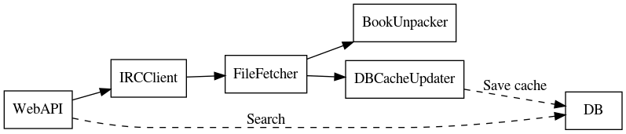

# What

Bookworm is a service to download (and convert) e-books from an IRC channel.  
There's a web-ui that works from the kindle browser.  

# Requirements

* S3 (minio can be used for a local instance).
    * the profile used for S3 is named `bookworm`
* redis
* sqlite
* python3.6
* `ebook-convert` installed (to convert all formats to mobi)
* `unar` to unarchive the books

## Web

### Web interface

Status of books in metadata:


Search results:


Locally available books:


This web interface works well in the kindle.

### API

* Lists jobs in progress (`/books/status`)
* Serves available books (Anything in the S3 bucket)
* Exposes a search endpont `/book/search?terms=...`
* Fetches books via `/book/fetch/`


# CLI

You can use the provided CLI tool:

```
$ python bookworm/cli.py neverwhere gaiman
....
16) {'bot': 'shytot', 'book': 'Neverwhere_ A Novel - Neil Gaiman.mobi'}
Input the number to download: 16
Status change 'REQUESTED'
Status change 'DOWNLOADING'
Status change 'DOWNLOADING', 'STATE': '25'
Status change 'DOWNLOADING', 'STATE': '45'
Status change 'DOWNLOADING', 'STATE': '70'
Status change 'DOWNLOADING', 'STATE': '95'
Status change 'DONE'
```

or you can control this via HTTP:

```bash
$ # populate the index, only once in a while for new books
$ http POST localhost:5000/books/batch_update
$ # search the book that you want
$ http localhost:5000/book/search terms=='brandon sanderson'
$ # download book, will be placed in the S3 bucket
$ http POST localhost:5000/book/fetch bot=Pondering42 book="some-book-from the index"
```

# Services

## Diagram



## Installation

```
sudo cp services/bookworm@.service /etc/systemd/system/
sudo systemctl daemon-reload
sudo systemctl start bookworm@ircclient.service
sudo systemctl start bookworm@file_fetcher.service
sudo systemctl start bookworm@unpacker.service
sudo systemctl start bookworm@web.service
sudo systemctl start bookworm@db_cache_populate.service
```

## IRC Client
In charge of processing received commands and sending them via IRC.  
Will forward details from DCC to the file fetcher via redis.

## File fetcher
In charge of fetching files specified via DCC.  
Will store the file in S3 and notify file details to the unpacker.

## Unpacker
In charge of taking a file (as provided from IRC), unpacking it and, if necessary, converting it to `mobi`.

# Batch process

To remove the initial roundtrip when searching for books, I keep a cache in a
local sqlite database.  
To populate this cache, there's an API endpoint (`books/batch_update`) that triggers each bot's `LIST` command, at `#ebooks`.
You should trigger this periodically (say, once a month) otherwise you will not be able to see any new book that is added to the lists.


# Misc

To update the graph in the README
```
$ dot docs/services.dot -Tpng > docs/services.png
```

`ebook-convert` is called with kindle\_pw profile.
